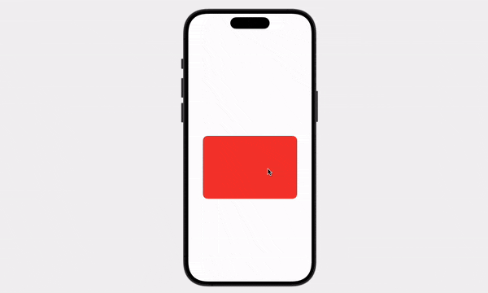

<h1 align="center">How to Flip a Card in SwiftUI</h1>

<p align="center">

</p>

# Contents

This is a beginner animation that flips a card by a tap gesture. It is 2 separate half-turns that give the illusion of a full flip. The cards are layered together in a Zstack. Each animation is timed to coordinate with the other.

- [Contents](#contents)
- [Code Breakdown](#code-breakdown)
- [The Whole Code](#the-whole-code)

# Code Breakdown

The animation needs a trigger that can be toggled on/off. This is achieved with a Boolean `isFlipped` it is set to false when the program starts.

```Swift
    @State var isFlipped: Bool = false
```

Width and height is set at the top of the struct using a pair of constants.

```swift
    let width: CGFloat = 300
    let heightL CGFloat = 200
```

Both `RoundedRectangles` are layered inside a ZStack, which also holds the `.onTapGesture`.

```swift
    Zstack {
        // RoundedRectangle()

        // RoundedRectangle()
    }
    .padding(.top, 100)
    .onTapGesture {
        isFlipped.toggle()
    }
```

When `isFlipped` is toggled, the `.rotation3DEffect` determins whether the card is turned from 0 to 90 or the opposite depending on the value of the Boolean.

For example: If `isFlipped = false` the red rectangle is at 0 degrees (facing the user) and the blue rectangle is at 90 degrees (hidden).

```swift
    .rotation3DEffect (
        .degrees(isFlipped ? 90 : 0)
        .axis: (x:0.0, y: 1.0, z: 0.0)
    )
```

Inside the `.degrees` brackets is a Turnery Operator (`isFlipped ? 90 : 0`). It is the same as this:

```swift

    if isFlipped == true {
        .degrees(90)
    } else if isFlipped == false {
        .degrees(0)
    }

    // or a simpler way.

    if isFlipped {
        .degrees(90)
    } else {
        .degrees(0)
    }
```

Once the degrees have been decided, an `.animation()` modifier is called using the same Turnery Operator technique. This is the same as:

```swift
    if isFlipped {
        .animation(.linear, value: isFlipped) // linear is the style of animation. It starts immediately.
    } else {
        .animation(.linear(duration: 0.15).delay(0.35), value: isFlipped)
        // linear animation, but it must take 0.15 seconds
        // and wait 0.35 seconds before it starts.
    }
```

This separates the animations into the first and second place executions. The responsibility of first and second are handed back and forth between the Rectangles as the vale of `isFlipped` changes.

> The visible rectangle is always the first animation.

__NOTE:__ The modifiers on each `RoundedRectangle` is the mirror of the other. The code is the same, the Turnery Operators are opposites. 

The code you are implementing is really just this, but twice.

```swift
RoundedRectangle(cornerRadius: 15) // this shape is hidden because it is at 90 degrees.
                .foregroundColor(.blue)
                .frame(width: width, height: height)
                .rotation3DEffect(
                    .degrees(isFlipped ? 0 : -90),
                     axis:(x: 0.0, y: 1.0, z: 0.0) // the rotation is on the y-axis
                ).animation(isFlipped ? 
                        .linear(duration: 0.15)
                        .delay(0.35) : .linear, value: isFlipped)
```

# The Whole Code

```swift
import SwiftUI

struct ContentView: View {
    
    @State var isFlipped: Bool = false
    
    let width: CGFloat = 300
    let height: CGFloat = 200
    
    var body: some View {
        ZStack {
            
            
            RoundedRectangle(cornerRadius: 15) // this shape is hidden because it is at 90 degrees.
                .foregroundColor(/*@START_MENU_TOKEN@*/.blue/*@END_MENU_TOKEN@*/)
                .frame(width: width, height: height)
                .rotation3DEffect(
                    .degrees(isFlipped ? 0 : -90),
                     axis: /*@START_MENU_TOKEN@*/(x: 0.0, y: 1.0, z: 0.0)/*@END_MENU_TOKEN@*/ // the rotation is on the y-axis
                ).animation(isFlipped ? .linear(duration: 0.15).delay(0.35) : .linear, value: isFlipped)
               
                
            
            
            RoundedRectangle(cornerRadius: 15) // you can see this one.
                .foregroundColor(.red)
                .frame(width: width, height: height)
                .rotation3DEffect( // this is the front 90 degrees in the card flip
                    .degrees(isFlipped ? 90 : 0),
                    axis: /*@START_MENU_TOKEN@*/(x: 0.0, y: 1.0, z: 0.0)/*@END_MENU_TOKEN@*/
                ).animation(isFlipped ? .linear : .linear(duration: 0.15).delay(0.35), value: isFlipped)
                
            
            
        }
        .padding(.top, 100)
        .onTapGesture { // this bool is toggled when the rectangle is tapped.
            isFlipped.toggle()
        }
    }
}

```
[Back to Top](#contents)